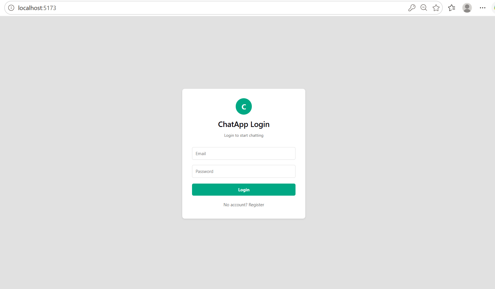
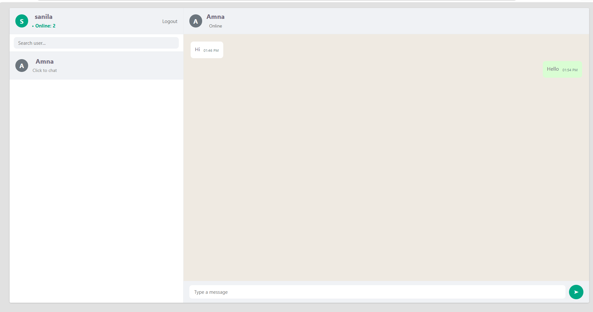
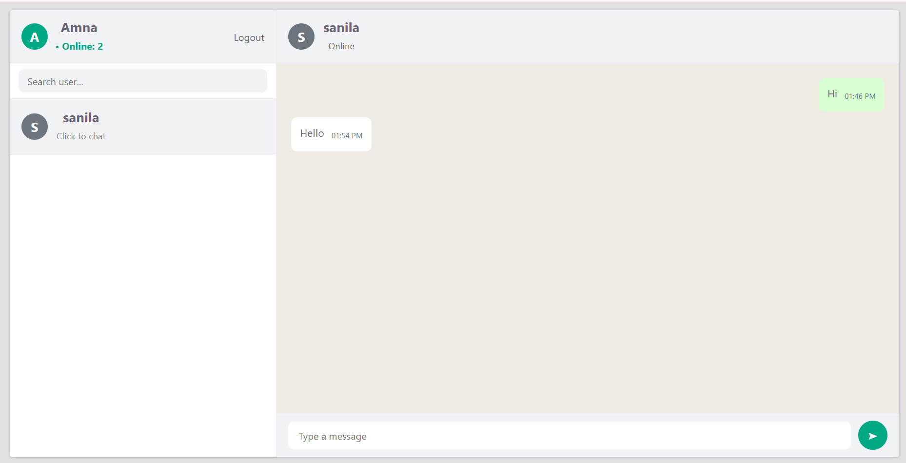
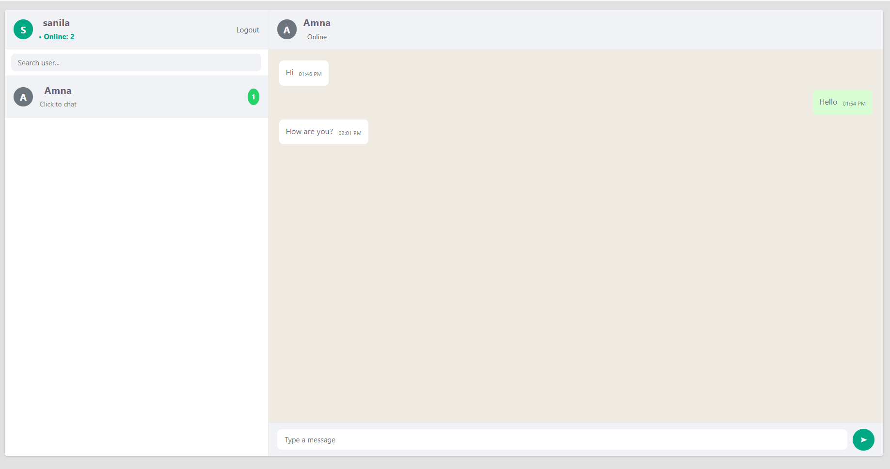

# 💬 ChatApp

## Real-Time WhatsApp Style Chat Application

A modern real-time messaging application inspired by WhatsApp Web, built with the MERN stack and Socket.IO for the University of Gujrat (Hayyatian Computing Society) assignment.

**Key features:** secure JWT authentication in httpOnly cookies, real-time messaging, online user tracking, unread message notifications, and a responsive UI.

---

## 🚀 Tech Stack

### Frontend

- **React.js** with Vite
- **React Router DOM**
- **Axios**
- **CSS**

### Backend

- **Node.js**
- **Express.js**
- **MongoDB**
- **Mongoose**
- **Socket.IO**
- **JWT Authentication**
- **Cookie Parser**

---

## ✨ Features

### 🔐 Secure Authentication

- **User Registration**
- **User Login**
- **JWT-Based Authentication**
- **httpOnly Cookie Storage**
- **Protected Chat Interface**
- **Persistent Login Sessions**

### 💬 Real-Time Messaging

- **Instant Message Delivery**
- **Socket.IO Powered Communication**
- **Real-Time Conversation Updates**
- **Chat History Persistence in MongoDB**

### 👥 User & Online Management

- **Displays all registered users**
- **Excludes the current logged-in user**
- **Live online user count**
- **User search functionality**

### 🔔 Notification System

- **Unread message badge counter**
- **Automatic badge reset on opening chat**
- **Live unread count updates**
- **Read status synchronization**

### 📱 Responsive Design

- **Mobile-friendly layout**
- **Responsive sidebar and chat window**
- **Smooth user experience across devices**

---

## ⚙️ Socket Events

| Event | Description |
|---|---|
| `connection` | Authenticates user using JWT cookie and marks the user online |
| `disconnect` | Updates online status when user leaves |
| `online:count` | Broadcasts the live online users count |
| `chat:history` | Retrieves previous conversation from MongoDB |
| `chat:send` | Saves and sends a new message |
| `chat:message` | Delivers message instantly to sender and receiver |
| `chat:unread` | Fetches unread message counts |
| `chat:read` | Marks messages as read |
| `chat:unread:update` | Updates unread badge count in real time |
| `chat:typing` | Sends typing indicator events |

---

## 🗄️ Database Schemas

### User Model

```js
{
  name: String,
  email: String,
  password: String
}
```

### Message Model

```js
{
  sender: ObjectId,
  receiver: ObjectId,
  text: String,
  read: Boolean
}
```

---

## 📂 Project Structure

```text
chat-app-assignment/
│
├── screenshots/
│   ├── p1.png
│   ├── p2.png
│   ├── p3.png
│   └── p4.png
│
├── server/
│   ├── models/
│   │   ├── User.js
│   │   └── Message.js
│   │
│   ├── routes/
│   │   └── authRoutes.js
│   │
│   ├── .env
│   ├── .env.example
│   ├── package.json
│   └── server.js
│
└── client/
    ├── src/
    │   ├── App.jsx
    │   ├── App.css
    │   ├── index.css
    │   └── main.jsx
    │
    ├── package.json
    └── vite.config.js
```

---

## 🛠️ Installation & Setup

### 1. Clone the repository

```bash
git clone [https://github.com/sanilashahzadi128/chat-app-assignment.git](https://github.com/sanilashahzadi128/chat-app-assignment.git)
cd chat-app-assignment
```

### 2. Setup the backend

```bash
cd server
npm install
npm run dev
```

### 3. Setup the frontend

```bash
cd client
npm install
npm run dev
```

---

## 🔑 Environment Variables

Create a .env file inside the server directory, or copy server/.env.example to server/.env and update the values.

```env
PORT=5000
MONGO_URI=your_mongodb_connection_string
JWT_SECRET=your_secret_key
CLIENT_URL=http://localhost:5173
```

---

## 📸 Application Screenshots

### 1. Login Page



### 2. User List & Header



### 3. One-to-One Chat Interface



### 4. Unread Message Badge & Status



---

## 🎯 Learning Outcomes

This project demonstrates practical implementation of:

- **MERN Stack Development**
- **REST API Integration**
- **JWT Authentication**
- **Cookie-Based Security**
- **MongoDB Data Modeling**
- **Real-Time Communication with Socket.IO**
- **State Management**
- **Responsive Web Design**
- **Full-Stack Application Architecture**

---

## 👨‍💻 Author

Developed as part of the University of Gujrat (HCS) assignment to demonstrate secure authentication, real-time communication, and modern full-stack web development using the MERN stack.